## How to execute studies with ROSE

### Overview

ROSE is intended to support empirical research into the practices of online social media users. ROSE supports such studies by providing a tool to collect data of study participants' interactions with online social media platforms about a specific study period.

The following picture gives an overview of the general study setup. It will be used to explain the general steps for executing a social media study with ROSE. 

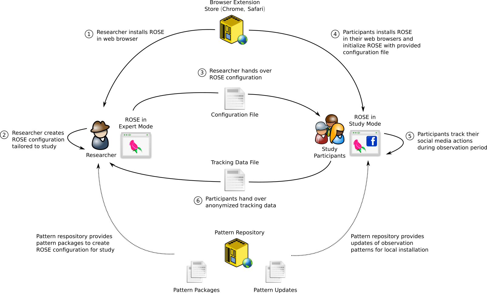

[Enlarge image](./images/rose-basic-setup.png)

The picture shows three technical entities involved in a study:
  * ROSE as a browser extension runs in the *web browsers* of the researchers executing the study and the participants taking part in the study. Both use ROSE in two different modes: the researchers use an expert mode to prepare the study and to process the tracking data by the participants. The participants use ROSE in a study mode with a configuration tailored to the specific needs of the study.
  * *Browser Extension Stores* for Chrome and Safari provide the browser extension for both the researchers and the participants
  * *Pattern Repository* is a set of files hosted on a web server containing information about how to track specific user data at participants' web browsers. These files are retrieved by ROSE to keep the tracking mechanism up-to-date and adapt to changes in social media sites.

Each study executed with ROSE has the following general workflow:
  1. Researcher installs ROSE from a *Browser Extension Store* into his local web browser and turns ROSE in an expert mode (*Features for researchers and developers*).
  2. Researcher creates a ROSE configuration file with a special *Study Creator* dialog and exports the configuration file for later exports into participants' installations of ROSE.
  3. Researcher informs her participants about the study and hands over the configuration file.
  4. Researcher asks her study participants to install ROSE from the *Browser Extension Store* and to initialize it with the configuration file previously created and handed over. At this step it makes sense to also inform participants about the privacy-aware design of ROSE to re-insure them about the trustworthiness of the software.
  5. Participants use ROSE over the intended study period. While using ROSE, ROSE might update tracking patterns from the *Pattern Repository* if changes in the web pages of the social media site requires it. This update function can be de-activated with an option in the configuration file.
  6. Participants hand over their tracking data the researcher for analysis. 

While this is the general workflow, researchers might choose to deviate. For instance, study participants could also use ROSE in the default mode without a tailored configuration file, but a default configuration.

### First steps as a researcher 

First of all ROSE needs to be installed in your local web browser (Chrome or Safari). Use the following links to the respective extension stores:

[Chrome Store](https://chrome.google.com/webstore/detail/rose/chmgghdkcookiojbnchechkhjfbadjkd)
[Safari Extensions Gallery](https://safari-extensions.apple.com/details/?id=com.kangoextensions.rose-2Q5XV9C329)

Once you have installed the extension, you can open its main user interface by clicking the ROSE button in your browser.

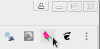

Upon the first run of ROSE you should now see a welcome screen with privacy notes and further information the use of overlays.

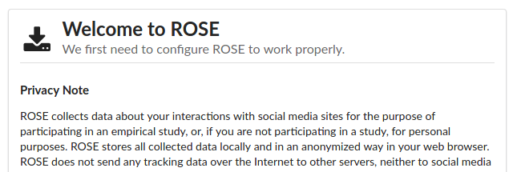

You need to confirm that you have read these notes in order to proceed.

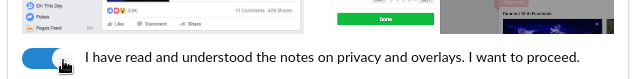

As you lack a configuration file, you now need to proceed by choosing the option "Use default configuration". At this point, your participants can later import a configuration file provided by you, instead of proceeding with the default configuration.

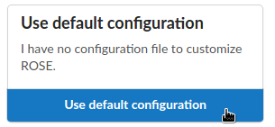

*Configuration files carry parameters for a tailored setup of ROSE. They allow to configure: what actions on social media sites ROSE should track at participants' web browsers, whether a special comment function shall be active, and how updates for tracking patterns shall be handled. As a researcher you should provide your participants a configuration file fitting the needs of your study. However, you can also ask your participants to use the default configuration, although this is not recommended.*

As a researcher you need access to additional ROSE functions that are not visible when starting ROSE the first time. These functions can be enabled by opening the *Settings* and activating the *Features for researchers and developers*.

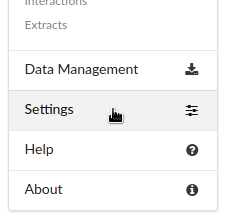

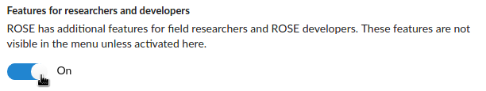

After these steps ROSE is prepared to create a study configuration file.

### Creating a study configuration file

Before creating a study configuration file, you should finalize the study design so far that you can answer the following basic questions:

  * On which social media site shall participants' actions being tracked?
  * What kind of actions need to be tracked?
  * Do dependencies between actions matter? Is it important for the study whether different, subsequent actions aiming on the same item need to be identified as such, e.g., in Facebook a "Like" and a "Comment" is applied to the same posting. 
  * Do dependencies between actions across study participants matter? For example, are participants belonging to a group whose members regularly interact on particular items on a social media site, and is this entanglement relevant for your study?
  * How critical is continuity for the study? If tracking of certain actions is suspended for a couple of days because of changes on the social media site does this easily become mission critical to your study?
  * Shall participants comment on their actions in situ as part of the study design?

ROSE can be used in various ways to satisfy the different needs expressed by the answers to these questions. It might require specific settings in the configuration file to account for your needs, and, in certain cases also changes in the ROSE infrastructure as explained earlier.

As a first step you should take a look at the study creator which can be accessed within the main menu "Researcher Features" under "Study Creator" after you have enabled the expert features in the settings as explained before.

#### Configure repository

For ROSE to function properly at participants' installations a valid repository configuration must be provided by entering the URL of a repository base file. 

The base file of the repository stored at the Github pages of the ROSE project is set as default; you can use this repository for your study. *However, you need to keep in mind that the ROSE developers cannot promise that this repository is up-to-date and the tracking functions you intend to use are working properly for the whole time of your study. If it is critical to your study having uninterrupted tracking of participants you should consider setting up and maintaining your own repository, which we will describe on further pages of this documentation yet to come.*

Besides choosing an appropriate repository solution, during the study you should also anyway monitor whether tracking patterns are yet working properly. If you choose to use the ROSE Github repository you can create a trouble ticket in case you find a tracking pattern to be broken at the [rose issue management on github](https://github.com/secure-software-engineering/rose/issues). 

After opting for the default URL or entered the base file URL of a different repository you can check your input by clicking "Retrieve repository to configure tracking", which also brings you to the next configuration step.

#### Configure tracking

Once you set up the repository correctly the patterns it contains are use to create a tailored tracking profile. First select the social media sites you want track from the content available in the repository by activating them after having retrieved the repository. 

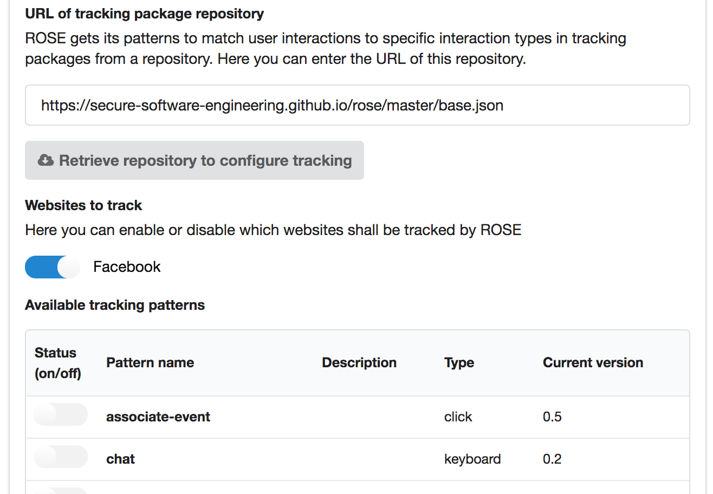

After you have activated a social media site all available patterns are shown. Enable all those actions you require to be tracked for the purpose of your study. You can track more actions than required, but this might be in conflict with your research protocol. Also you can track actions on multiple social media sites at the same time; activate all required social media sites and select the actions to be tracked individually for each site. 

*As mentioned before during the study you should repeatedly check whether the tracking patterns for each selected action are working properly. If a pattern becomes broken, correct it or inform the repository administrator*

Setting the repository and range of the tracking function is the major step towards a study configuration file. However, few further options need to be considered before finalizing the study creator.

#### Handling updates

The patterns you configured might require updates during the course of your study in case one of the tracked social media sites implements changes to their design. Patterns are usually flexible to some degree to adapt to these changes, however, at a certain point they need to be re-adjusted. These revised patterns then need to be distributed to participants' installations of ROSE. The following options in the study creator deal with this issue.

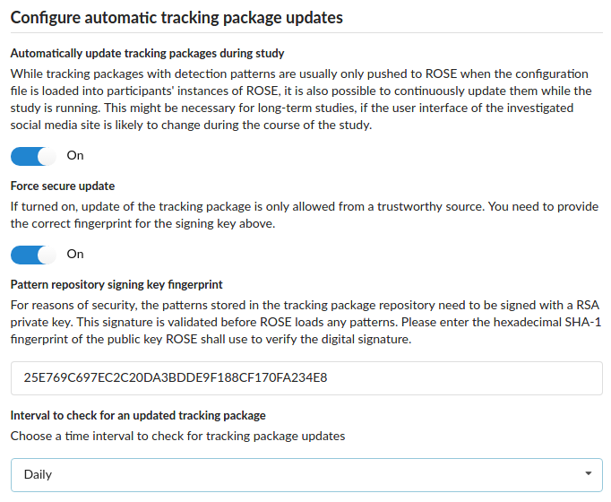

First you need to decide whether such automatic updates should be allowed at all. In general automatic updates are recommended, but in few cases it makes sense to go without them: only by turning of the automatic updates you can make sure that all your participants' have the same state of ROSE at every given time during the whole study. If updates are turned on, you need to keep in mind that they cannot be done at the same time for all participants because of technical reasons. Slight deviations in the scope of tracking across participants might be the result. This should not be a problem for most studies but might be relevant when a very tight control of the conditions of participant tracking is required. Furthermore, your research protocol might forbid that ROSE automatically downloads tracking packages from a remote source without case-by-case explicit consent of your participants.

*Note that updates cannot be used to activate tracking functions that were not activated in the first place, when the configuration file was created.*

The next option to consider is the *secure update*. ROSE has build-in cryptographic functions allowing to check the origin of a repository by validating the signature of repository files. To this end, if you force secure updates you need to provide the SHA-1 fingerprint of the PGP public key that belongs to the private key allowed to create the signature; only one key pair can be provided. If during the update the signature cannot be validated using repository file content and the public key stored in the repository, or if the fingerprint of the public key stored in the repository does not match the given fingerprint (key pinning), the update is rejected.

*It is recommended to always use secure updates. Tracking patterns from invalid malicious sources could be used to extent the tracking range. However, there is no immediate threat that this could lead to an actual harm to participants.*

*The public key of the ROSE Github repository key pair has the SHA-1 fingerprint 25E769C697EC2C20DA3BDDE9F188CF170FA234E8. The associated private key is sealed in a hardware token only accessible to team members.*

Finally, the interval to check updates needs to be set. The shorter the interval the faster revised patterns become active, but the more network traffic ROSE creates. 

#### Identifiers and privacy options

An important feature of ROSE is its ability not only to track participants' actions but also references to the content at which actions are targeted. This feature has a privacy-aware design: Researchers can analyze dependencies between participants' actions, but cannot reveal the actual plain content involved in those actions, such as the actual text messages in chats, text of postings, photos, videos etc. This privacy protection is achieved with identifiers calculated from the online content - visible or invisible - the participants interact with. How this works is explained with the following picture.

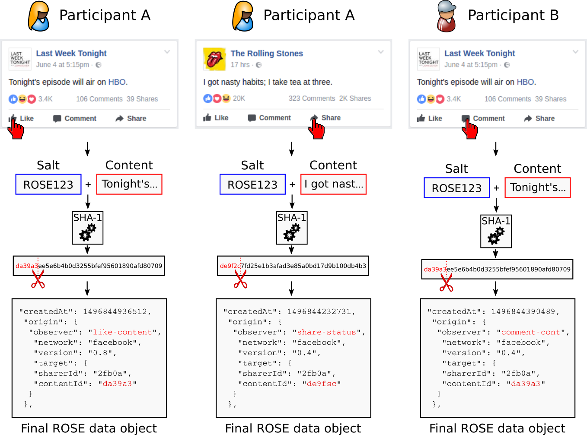

[Enlarge image](./images/rose-identifiers.png)

In this example, participant A uses Facebook and "_likes_" a posting on her "_feed_" (left column). ROSE records this action as it has a pattern available for tracking "_like_" events on Facebook. But ROSE not only records the event but - depending on the tracking pattern - reads out a visible or invisible part of the content of the posting. In this case we assume, it is the text string "Tonight's episode will air on HBO." This string is concatenated with a cryptographic *salt* - in our case "ROSE123" - and finally fed into a cryptographic hash function. This function returns a string called message digest, a kind of short version of the initial string. This calculation is irreversible, making it impossible for someone to break the privacy of participant A by restoring the original content from this string.

However, someone with access to Facebook's content could calculate hash values for available content and re-identify in ROSE data the content participant A interacted with. For that reason ROSE stores only a small fragment with a previously defined *content identifier length* - in our case five digits - thereby intentionally creating collusions, when someone tries to re-identify content. That means that not only the content in the post of participant A leads to the content identifier "da39a" but also multiple other kinds of content on Facebook. This can be understood as a kind of laying false trails in the data, making it much more difficult (and computationally costly) to specifically re-identify participant A. As a side effect, identifiers are easier to handle during data analysis as they are shorter.

This protection mechanism can be tightened even more by choosing a random salt (not a predictable string "ROSE123" as in our example) and to remove the salt from participants' ROSE data sets before further using or sharing them. Without any knowledge of the used salt, it is practically unfeasible to re-identify participant A by means of the identifiers ROSE creates. 

Coming back to the depicted example, in case participant A initiates another action (middle column) referring to a different object than before (posting "I got a nasty habit; I take tea at three.") this leads to a different identifier "de9fsc". But if participant A or even another study participant B executes an action on the same post mentioned first in our example (right column), the content identifier remains the same "da39a" and both actions can be correlated from ROSE data by the researchers afterwards.

Of course, as only a fragment of the message digest is stored, actions might also correlate via their identifiers, because of collusions. But this is unlikely if the *content identifier length* was chosen long enough with respect to the kind of study you plan. As a rule on thumb, an identifier length of five allows for 16⁵ (~1 million) different identifiers which should be sufficient for studies which aim on correlating actions across a multitude of participants. If you want to correlate actions only within the data of individual participants, a length of four digits (16⁴~65 thousand identifiers) should be sufficient. It might help to roughly estimate the size of the set of identifiers in which you want to find correlations and multiply it with a fixed factor such as 1000 to calculate the size of the space of possible of identifiers. Starting from this required identifier space size you can easily calculate the appropriate *content identifier length*.

To configure this privacy mechanism the study creator provides two options already mentioned before:

  * **Cryptographic salt for content identifiers** allows to set up the salt used to generate ROSE identifiers. As noted before you can generate a random salt and can remove it later from ROSE data when you decide to share this data for the purpose of your research. 
  * **Content identifier length** the length of the fragment cut of from the message digest. Every additional digit increases the available identifier space by a factor of 16. Choose the identifier length according to your requirements of correlating ROSE data for individual participants or across participants.

#### Optional Facebook features

Finally, an experimental comment function specifically for Facebook can be activated in the study configuration. To use this feature you also need to enable tracking Facebook actions when configuring the action tracking as described before. 

This comment function can be used by study participants to comment content on Facebook in situ for the purpose of your study. It is directly embedded into the user interface of the Facebook feed of participants by adding a red ribbon on single feed items as shown in the following picture.

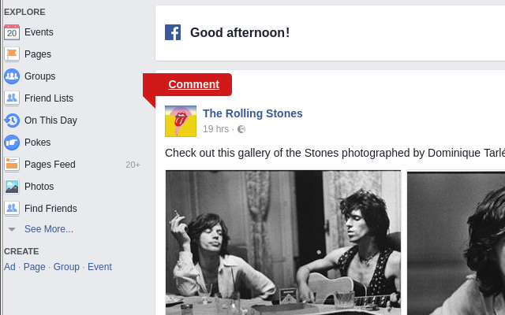

After the participant clicks the ribbon, a sidebar slides in from the left window boundary with input fields and rating options, see picture below. The participant can enter comments which are stored in the participant's ROSE data. 

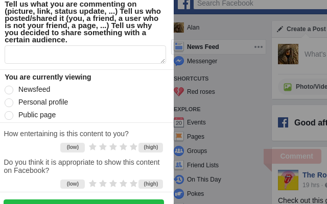

A ROSE identifier is assigned to each comment representing the feed item to which it relates. Hence comments can also be related to participant's actions on this item.

In the study configurator you can choose whether the comment function should be visible to participants by enabling or disabling *In-situ comments*. The *in-situ rating option* can be activated separately.

#### Exporting and using the configuration file

After you finished configuring your study, you need to export the created configuration into a file which is the last option on the study configurator page. You can enter a file name and by clicking "Export" the file is created and you can store it on your computer. 

Later for your study you need to distribute this configuration file to your participants. On the welcome screen participants can load this file instead of the default configuration when they open the ROSE user interface for the first time. Participants' local installations are then adapted to the needs of your study.

